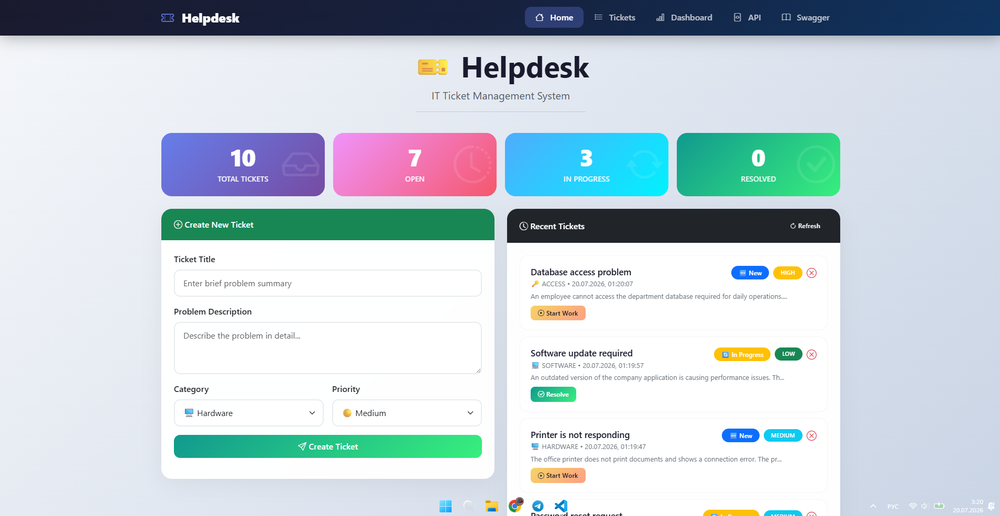
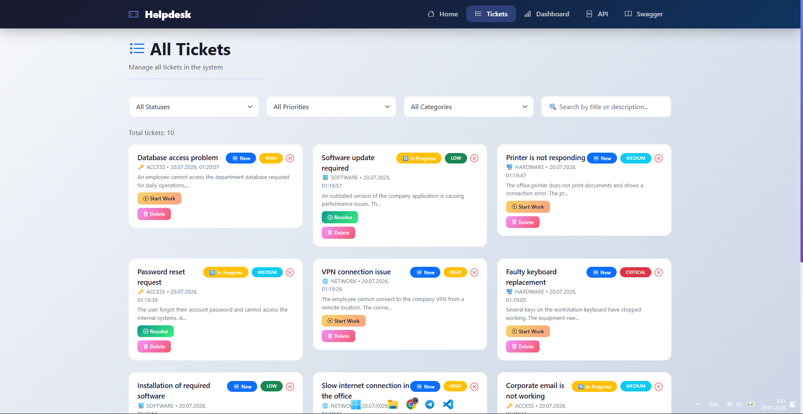
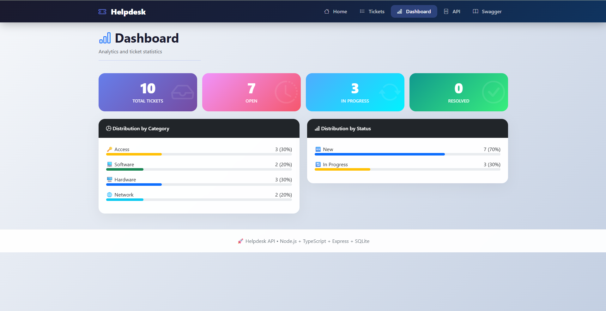
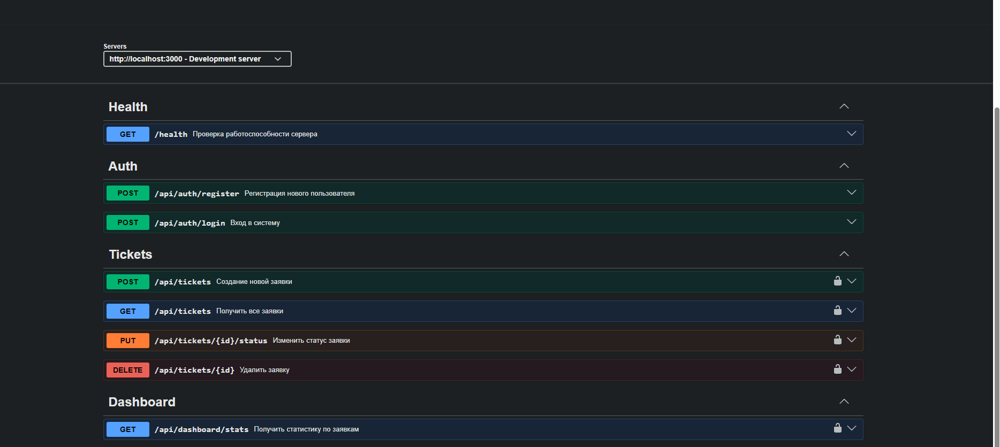

# 🎫 Helpdesk API

[](https://nodejs.org/)
[](https://www.typescriptlang.org/)
[](https://expressjs.com/)
[](https://www.sqlite.org/)
[](https://www.prisma.io/)
[](https://opensource.org/licenses/MIT)

> **An enterprise-ready IT Helpdesk ticket management system featuring a REST API, JWT authentication, Swagger documentation, and a modern web interface.**

---

# 📌 About the Project

Helpdesk API is a full-stack ticket management system designed to simplify IT support workflows.

Instead of losing requests in emails, Slack messages, or Telegram chats, employees can submit support tickets through a centralized platform where IT specialists can track, prioritize, and resolve issues efficiently.

The project demonstrates modern backend development using Node.js, Express, TypeScript, Prisma ORM, and SQLite, along with a responsive frontend built with HTML, CSS, JavaScript, and Bootstrap.

---

# 🎯 Business Problem

Many companies struggle with IT support requests because they are scattered across:

- 📧 Email
- 💬 Slack
- 📱 Telegram
- 📝 Paper notes
- 📞 Phone calls

This often leads to:

- Lost requests
- Missed deadlines
- Poor communication
- Lack of reporting
- No analytics

## Solution

Helpdesk API provides:

- ✅ Centralized ticket management
- ✅ User authentication
- ✅ Role-based access
- ✅ Ticket tracking
- ✅ Dashboard analytics
- ✅ REST API
- ✅ Interactive Swagger documentation

---

# 📸 Screenshots

## Home Page



---

## Tickets



---

## Dashboard



---

## API



---

## Swagger


---

# 🚀 Features

## Authentication

- JWT Authentication
- User Registration
- User Login
- Password Hashing
- Role-based Authorization

---

## Ticket Management

- Create Tickets
- Update Tickets
- Delete Tickets
- View All Tickets
- Search Tickets
- Filter by Status
- Filter by Priority
- Filter by Category

---

## Dashboard

- Ticket Statistics
- Category Distribution
- Status Distribution
- Priority Distribution
- Auto Refresh

---

## REST API

- Full CRUD Operations
- JSON Responses
- Validation
- Error Handling
- Swagger Documentation

---

# 🛠 Tech Stack

## Backend

- Node.js 18
- Express.js
- TypeScript
- Prisma ORM
- SQLite
- JWT
- bcrypt
- Swagger UI

---

## Frontend

- HTML5
- CSS3
- Bootstrap 5
- JavaScript (ES6)

---

## Development Tools

- Docker
- Docker Compose
- Nodemon
- Git
- GitHub

---

# 📂 Project Structure

```text
helpdesk-api/
│
├── prisma/
│   ├── schema.prisma
│   ├── migrations/
│   └── seed.ts
│
├── public/
│   ├── css/
│   ├── js/
│   └── index.html
│
├── screenshots/
│   ├── screenshot-home.png
│   ├── screenshot-tickets.png
│   ├── screenshot-dashboard.png
│   ├── screenshot-api.png
│   └── screenshot-swagger.png
│
├── src/
│   ├── controllers/
│   ├── middleware/
│   ├── routes/
│   ├── services/
│   ├── config/
│   └── app.ts
│
├── .env.example
├── docker-compose.yml
├── package.json
└── README.md
```

---

# 🚀 Quick Start

## Requirements

- Node.js 18+
- npm
- Docker (optional)

---

## Clone Repository

```bash
git clone https://github.com/yourusername/helpdesk-api.git

cd helpdesk-api
```

---

## Install Dependencies

```bash
npm install
```

---

## Configure Environment

```bash
cp .env.example .env
```

Edit the `.env` file if necessary.

---

## Database

Run Prisma migrations:

```bash
npx prisma migrate dev --name init
```

Seed the database:

```bash
npm run seed
```

---

## Start Development Server

```bash
npm run dev
```

Application:

```
http://localhost:3000
```

---

# 🐳 Docker

Start the project:

```bash
docker-compose up -d
```

Stop:

```bash
docker-compose down
```

---

# 📖 API Documentation

Swagger UI:

```
http://localhost:3000/api-docs
```

Example endpoints:

| Method | Endpoint | Description |
|----------|----------------|----------------|
| GET | /api/tickets | Get all tickets |
| GET | /api/tickets/:id | Get ticket |
| POST | /api/tickets | Create ticket |
| PUT | /api/tickets/:id | Update ticket |
| DELETE | /api/tickets/:id | Delete ticket |

---

# 🔐 Authentication

Protected endpoints require:

```
Authorization: Bearer YOUR_JWT_TOKEN
```

---

# 📊 Ticket Workflow

```
NEW
   ↓

IN_PROGRESS
   ↓

RESOLVED
   ↓

CLOSED
```

---

# 📈 Future Improvements

- Email Notifications
- File Attachments
- Comments
- Real-time Updates (WebSockets)
- Dark Mode
- PostgreSQL Support
- Docker Production Deployment
- Unit Tests
- CI/CD Pipeline

---

# 🤝 Contributing

Contributions are welcome!

1. Fork the repository

2. Create a feature branch

```bash
git checkout -b feature/my-feature
```

3. Commit changes

```bash
git commit -m "Add new feature"
```

4. Push

```bash
git push origin feature/my-feature
```

5. Open a Pull Request

---

# 📄 License

This project is licensed under the MIT License.

---

# 👨‍💻 Author

**Your Name**

GitHub:

https://github.com/yourusername

LinkedIn:

https://linkedin.com/in/yourprofile

---
⭐ If you found this project useful, consider giving it a star on GitHub!